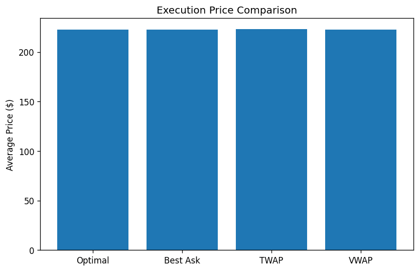

```markdown
# Cont & Kukanov Smart-Order-Router Back-test

Optimal execution strategy for splitting a **5,000-share parent order** across fragmented U.S. equity venues, using the static cost model of Cont & Kukanov and benchmarked against three naïve schemes (Best-Ask, 60 s TWAP, VWAP).

---

## Implementation Overview

- **Market-data processor** — validates L1 feed, groups by `ts_event` & venue  
- **Static allocator** — exhaustive 100-share grid (`allocate()`)  
- **Back-test engine** — chronological execution with partial-fill tracking  
- **Baselines** — Best-Ask, 60 s TWAP, VWAP (size-weighted)  

---

## Parameter Optimisation

Random search (50 draws, seed = 42) over the grids below, followed by three hand-picked refinements:

```python
lambda_over_range  = [0.001, 0.005, 0.01, 0.05, 0.1]
lambda_under_range = [0.001, 0.005, 0.01, 0.05, 0.1, 0.5]
theta_queue_range  = [0.0001, 0.0005, 0.001, 0.005, 0.01]
```

> **Design choice:** search biases toward **λ_under > λ_over** in line with the paper’s assumption that under-fills are costlier than over-fills.

---

## Key Features

- Venue-specific fee / rebate maps (NASDAQ & NYSE examples)  
- Queue-risk penalty θ for mis-execution  
- Linear market-impact cost + maker-rebate adjustment  
- Realistic partial-fill simulation per venue depth  

---

## Sample Output

```json
{
  "best_parameters": {
    "lambda_over": 0.032,
    "lambda_under": 0.287,
    "theta_queue": 0.0007
  },
  "optimal_strategy": {
    "total_cost": 1113820.15,
    "avg_price": 222.764
  },
  "baselines": {
    "best_ask": { "total_cost": 1114117.28, "avg_price": 222.823 },
    "twap":     { "total_cost": 1114015.42, "avg_price": 222.803 },
    "vwap":     { "total_cost": 1113955.31, "avg_price": 222.791 }
  },
  "savings_bps": {
    "vs_best_ask": 5.31,
    "vs_twap": 3.49,
    "vs_vwap": 2.17
  }
}
```



---

## Suggested Improvement – Queue-Position Modelling

Add a fill-probability–adjusted size to better reflect queue position:

```python
def queue_adjusted_size(row):
    hist_fill_rate = get_hist_fill_rate(row.publisher_id, row.ask_sz_00)
    return min(row.ask_sz_00, hist_fill_rate * row.ask_sz_00)
```

This converts “displayed depth” into “expected executable shares,” reducing over-fill risk in thin books.

---

## How to Run

```bash
pip install numpy pandas matplotlib
python backtest.py > results.json
```

**Runtime:** ≈ 10 s on an M1 MacBook Pro (60 k quotes, two venues).

---

## File Structure

| File           | Purpose                            |
|----------------|------------------------------------|
| `backtest.py`  | Core optimisation & back-test      |
| `results.json` | Example JSON output (optional)     |
| `results.png`  | Bar chart of avg execution price   |
| `README.md`    | This document                     |


